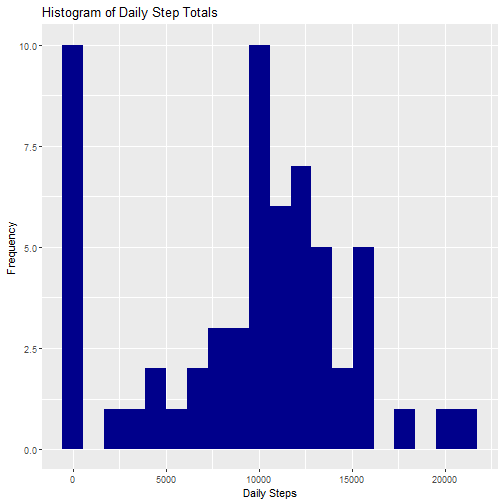
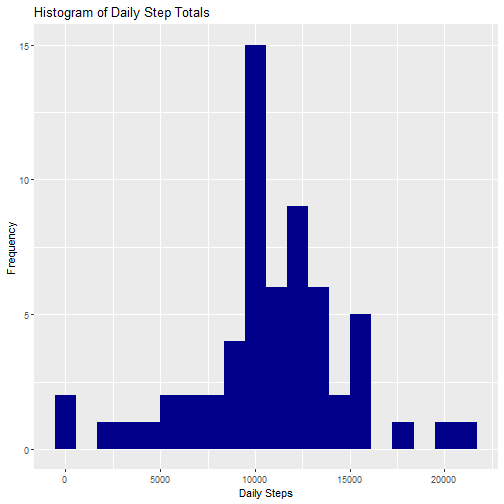

## Analysing Movement Through Personal Activity Monitoring Device Data

This analysis uses an anonymous sample of personal activity monitoring device data to study movement patterns. The analysis will use the tidyverse family of R packages.

### Loading and preprocessing the data  
First, loading the data and investigating its formatting: 

```r
data <- read.csv("activity/activity.csv")
str(data)
```

```
## 'data.frame':	17568 obs. of  3 variables:
##  $ steps   : int  NA NA NA NA NA NA NA NA NA NA ...
##  $ date    : Factor w/ 61 levels "2012-10-01","2012-10-02",..: 1 1 1 1 1 1 1 1 1 1 ...
##  $ interval: int  0 5 10 15 20 25 30 35 40 45 ...
```

```r
summary(data$steps)
```

```
##    Min. 1st Qu.  Median    Mean 3rd Qu.    Max.    NA's 
##    0.00    0.00    0.00   37.38   12.00  806.00    2304
```

```r
summary(data$interval)
```

```
##    Min. 1st Qu.  Median    Mean 3rd Qu.    Max. 
##     0.0   588.8  1177.5  1177.5  1766.2  2355.0
```

We have three variables. 'date' is the date of the record, 'interval' represents a five minute interval during that date, and 'steps' is the number of steps recurded during that interval. we'll need to reformat 'interval' in a character format that matches the HH:MM time format, then combine it with the 'date' column and have R interpret the combination as a date-time column. Then we can split the result back into date and time (in hours) components for convenience.

```r
data %>% 
    mutate(interval = as.character(interval)) %>%
    mutate(interval = case_when(nchar(interval) == 1 ~
                                    paste("00:0", interval, sep = ""),
                                nchar(interval) == 2 ~
                                    paste("00:", interval, sep = ""),
                                nchar(interval) == 3 ~
                                    paste("0", substr(interval, 1, 1), ":", 
                                          substr(interval, 2, 3), sep = ""),
                                nchar(interval) == 4 ~
                                    paste(substr(interval, 1, 2), ":",
                                          substr(interval, 3, 4), sep = ""))) %>%
    mutate(datetime = paste(as.character(date), interval, sep = " ")) %>%
    mutate(datetime = ymd_hm(datetime)) %>%
    mutate(date = date(datetime)) %>%
    mutate(time = hour(datetime) + minute(datetime) / 60 ) -> data
```

###Mean total steps taken per day  
Now that we have the data in a handy format, we can perform some analyses. First, let's look at the distribution of daily step totals, as well as the mean and median. For now, we'll ignore missing values of 'steps'.

```r
data %>%
    group_by(date) %>%
    mutate(total_steps = sum(steps, na.rm = TRUE)) %>%
    filter(row_number() == 1) %>%
    ungroup() -> daily_summary
mean_steps <- mean(daily_summary$total_steps)
median_steps <- median(daily_summary$total_steps)
```

The subject took a mean of 9354.23 and a median of 10395 per day. The overall distribution looked like this: 

```r
ggplot(daily_summary, aes(total_steps)) +
    geom_histogram(bins = 20, fill = "dark blue") +
    labs(x = "Daily Steps",
         y = "Frequency",
         title = "Histogram of Daily Step Totals")
```



The distribution runs from 0, which likely indicates days when the subject didn't wear their device, to just over 20,000.  

###What is the average daily activity pattern?
Now let's look at what times of day the subject was active. This plot shows the average number of steps taken during each 5 minute interval of the day (again, ignoring missing values). I've also identified the time interval with the largest average number of steps.  

```r
data %>%
    group_by(time) %>%
    mutate(avg_steps = mean(steps, na.rm = TRUE)) %>%
    filter(row_number() == 1) %>%
    ungroup() -> interval_summary

ggplot(interval_summary, aes(time, avg_steps)) +
    geom_line(col = "dark blue", lwd = 2) +
    labs(x = "Time at Beginning of Interval",
         y = "Average Steps in Interval",
         title = "Average Number of Steps Taken During Each 5 Minute Interval of the Day") +
    scale_x_continuous(breaks = c(0, 2, 4, 6, 8, 10, 12, 14, 16, 18, 20, 22, 24),
                       labels = c("12:00 am", "2:00", "4:00", "6:00", "8:00", "10:00",
                                  "12:00 pm", "2:00", "4:00", "6:00", "8:00", "10:00",
                                  "12:00 am")) +
  coord_cartesian(xlim = c(0, 24))
```


```r
time_max_act <- interval_summary[interval_summary$avg_steps == max(interval_summary$avg_steps),]
```

The time interval with the largest average number of steps was the one beginning at 8:35am. 

###Missing Values  

Unfortunately, our data has a significant number of missing values. The total number is 

```r
missing_steps <- is.na(data$steps)
sum(missing_steps)
```

```
## [1] 2304
```

```r
sum(missing_steps) / length(missing_steps)
```

```
## [1] 0.1311475
```

So about 2,300 observations, or a little over 13% of the data, is missing. Let's try to impute some reasonable values for those we missed. We saw in the plot above that the subject has pretty high peaks and low valleys in their walking distances during the day. I think, therefore, that the reasonable estimate for a missing time is the average steps walked in that interval on other days when data is available. There might also be day of the week patterns in the person's movement, so I'll only compare missing values from weekends (ISO days 6 and 7) to available times on weekends, and compare weekdays (ISO days 1 through 5) to weekdays. Let's see how that works out: 

```r
data %>%
  mutate(weekday = wday(datetime)) %>%
  mutate(weekend = as.factor(ifelse(weekday >= 6, "weekend", "weekday"))) %>%
  group_by(weekend, time) %>%
  mutate(steps_imp = ifelse(is.na(steps) == FALSE, steps, 
                            mean(steps, na.rm = TRUE))) %>%
  ungroup() %>%
  select(steps = steps_imp, date, interval, datetime, time, weekend) -> data_impute
```

Alright, let's compare the results to our previous look at average steps per time of day: 

```r
data_impute %>%
    group_by(date) %>%
    mutate(total_steps = sum(steps, na.rm = TRUE)) %>%
    filter(row_number() == 1) %>%
    ungroup() -> daily_summary_impute
mean_steps_impute <- mean(daily_summary_impute$total_steps)
median_steps_impute <- median(daily_summary_impute$total_steps)
```

Our new imputed dataset estimates that the subject took a mean of 10799.41 and a median of 10600 per day. that's a difference of 1445.18 per day compared to the previously estimated mean, and a difference of 205 from the previously estimated median. Here's a histogram, for comparison with the one above:  

```r
ggplot(daily_summary_impute, aes(total_steps)) +
    geom_histogram(bins = 20, fill = "dark blue") +
    labs(x = "Daily Steps",
         y = "Frequency",
         title = "Histogram of Daily Step Totals")
```



The spike at 0 steps per day has almost disappeared, but the distribution of days with some steps doesn't appear to have changed dramatically. The typical day still clearly involves around 10,000 steps for this subject. 

### Average daily activity pattern of weekdays vs. weekends  
Let's dig into whether the subject's activity varies significantly between weekdays and weekends. I've already created a 'weekend' variable in the imputed dataset that indicates whether the interval occurred during a weekday or on a weekend. The plot below charts average steps per time interval, splitting out weedays and weekends.

```r
data_impute %>%
    group_by(weekend, time) %>%
    mutate(avg_steps = mean(steps, na.rm = TRUE)) %>%
    filter(row_number() == 1) %>%
    ungroup() -> interval_summary_impute

ggplot(interval_summary_impute, aes(x = time, y = avg_steps, col = weekend)) +
  facet_wrap(facets = interval_summary_impute$weekend, nrow = 2, ncol = 1) +
  geom_line(lwd = 2) +
    labs(x = "Time at Beginning of Interval",
         y = "Average Steps in Interval",
         title = "Average Number of Steps Taken During Each 5 Minute Interval of the Day") +
    scale_x_continuous(breaks = c(0, 2, 4, 6, 8, 10, 12, 14, 16, 18, 20, 22, 24),
                       labels = c("12:00 am", "2:00", "4:00", "6:00", "8:00", "10:00",
                                  "12:00 pm", "2:00", "4:00", "6:00", "8:00", "10:00",
                                  "12:00 am")) +
  coord_cartesian(xlim = c(0, 24)) +
  scale_color_manual(values = c("dark green", "purple"))
```


The subject's movement does appear to be different on weekends. It begins a bit later, indicating that the subject sleeps in, and while both conain a morning peak between 8:00 and 9:00am, the one on the weekend is higher. Perhaps the difference between walking to work and going for a jog? As well, on weekends the subject is significantly more active in the afternoons.
